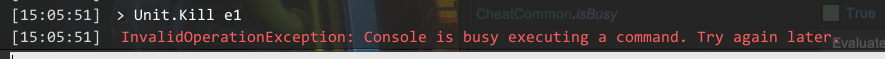

[toc]

# Console Commands List

## help

Show help for a command. Effectively a quick one-line summary of a command.

### Arguments

`help command`

- `command`: The name of the command.

### Examples

- `help Battle.Win`: Show the help for Battle.Win command.
- `help help `: Show the help for the help command itself.

## clear

Clear the console.

### Examples

- `clear`

## Console.BusyGuard

Turn on/off the console busy guard.

### Arguments

`Console.BusyGuard onOff`

- `onOff`: Either 'on' or 'off'.

### Examples

- `Console.BusyGuard on`: Enable the console busy guard.
- `Console.BusyGuard off`: Disable the console busy guard.

### Notes

- Console busy guard is a feature of MonsterTrainConsole to prevent accidentally running two or more time-consuming commands at the same time. For example, it may result unexpected animation sequence that might cause softlock if you try to use Unit.Kill on multiple units within short period of time. MonsterTrainConsole tries to prevent such bugs by making them execute one at a time.

  However, there might be certain complicated situations where busy guard fails to "unbusy" the console although the task is over. In that case the console refuses to execute commands even if it seems not doing anything at all:

  

  This command is used for such situation. You can forcefully disable busy guard to ignore the busy guard and to use commands regardless of whether the console is doing something or not. Do note that you're at your own risk.

- The effect of this command persists through the game process (until it exits).

